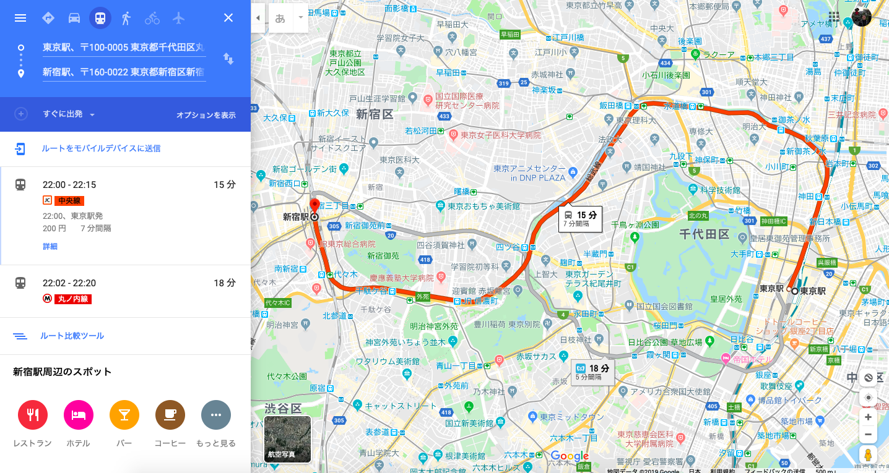

## Purpose
This tool is intended to extract the transit fares from Google Maps.

## Operation
1. Manually set up Google Maps
  * (on MacBook Air, 13inch screen), make new desktop and open Google Chrome browser.
  * Make the browser full screen (click on the green button).
  * Go back to the desktop with the open terminal.
2. Run `main.py` and switch to the google maps desktop within 3 seconds.
3. The program will take control of the mouse and keyboard. Don't touch it.
4. You can regain control by using the fail-safe.
  * Move the mouse into the upper left corner of the screen and wait a moment.

### File Descriptions
* main.py
    * the main file.
* scrape.py
    * high level commands, the basic workflow.
* constants.py
    * global constants
* directurlinput.py
    * input the destination and starting stations directly into the browser to avoid some gui manipulation steps.

## Train Data
This minimum viable product does not include bus routes and stops.
It does not include all the train stations, yet.
Mostly, I am working with data in the Tokyo area.

### Major Steps
__Performed mostly by the program, not the user__
1. Open Google Chrome browser and go to Google Maps.
  * Easier to do this manually.
2. Enter a destination into the search input.
3. Enter a starting station.
4. Screenshot the transit fare.
5. Extract the text from the image.
6. Save the fare with the station info.
7. Repeat from 3 until all trip data is collected.

